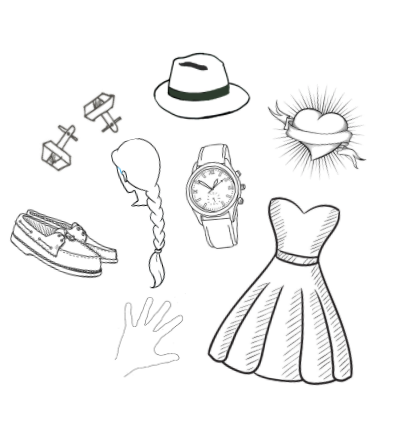
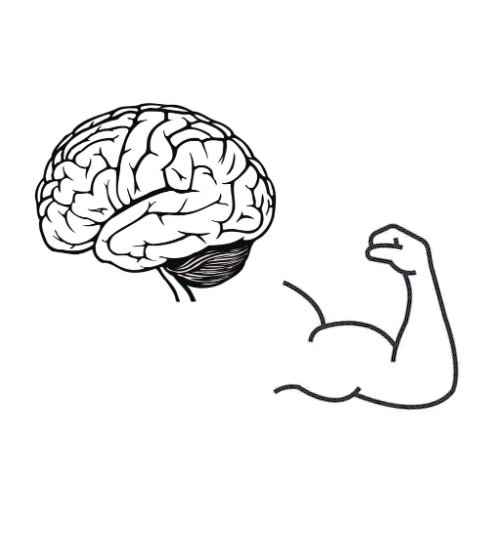

# Build a Virtual Lite-Brite

[Thinking of a Lite-Brite](https://en.wikipedia.org/wiki/Lite-Brite) may make you nostalgic. But these days, they are covered in germs. In this live, instructor-led workshop, you will build and customize your very own _virtual_ Lite Brite that you can share with anyone around the world!

_This will be best experienced on a desktop or laptop computer._

## Goals

- Build and customize a virtual Lite-Brite
- Gain _exposure_ and familiarity with some HTML, CSS, and JavaScript
- Determine if coding is something you enjoy doing and want to pursue further

Disclaimer: We won't become experts in these languages today. And you may leave with more questions than answers!
  

## Programming Languages We Will Use

Building the user-facing part of a website or app is referred to as Front End Engineering. Building a Front End requires the writing code in three programming languages, and making the code in each language "talk to" the code in the others.

It can feel like a lot, but let's start by building an understanding of what each language is responsible for. We will make some comparisons to the human body to create context.

<section class="data-type-cards language-cards">
  

    <h3>HTML</h3>
    
HTML holds the content we see on a page (text, images) and defines the structure and order in which the content appears.

    
We can think of HTML as the skeleton of our webpage; without it, we'd just be a blob:

    
  

  

    <h3>CSS</h3>
    
CSS defines the look and feel of a webpage - it can change the size or layout of items on a page, change colors, fonts, and more!

    
We can think of CSS as anything that makes us unique and recognizable - our skin, hair, clothes, style, etc.

    
  

  

    <h3>JavaScript</h3>
    
JavaScript is what lets the user interact with a page. For example, clicking a button and getting some sort of response.

    
We can think of JavaScript as the brain and muscle of our webpage, as it powers all the action:

    
  

</section>
  

## Project Setup

We will work off of a starter kit that has already been created. Click [this link to access the starter kit](https://codepen.io/turing-trycoding/pen/RwXPeNr) in codepen.io. Here's how we will use this code:
1. Fork the pen using the `Fork` button along the bottom of the page.  This creates your own copy of the starter code so that you can make and keep changes to the code!
1. After forking, substitute your name for `NAME` on line 1 of the html file
1. Click `Save` or wait just a moment for codepen to autosave and update the result (the bottom portion of the page).

  
### Up Next
- [What is Front End and Back End Engineering?](../what-is-fe-be)
- <strong>[Project Setup](../litebrite)</strong>
- [HTML - Content](../html)
- [CSS - Styles](../css)
- [JavaScript- Explore](../js-1)
- [JavaScript - Create](../js-2)
- [Extensions](../extensions)
- [Wrap-Up](../wrap-up)
